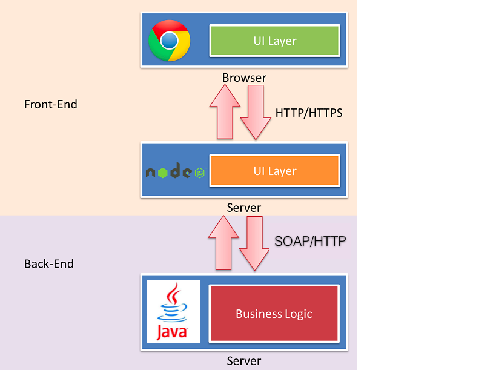
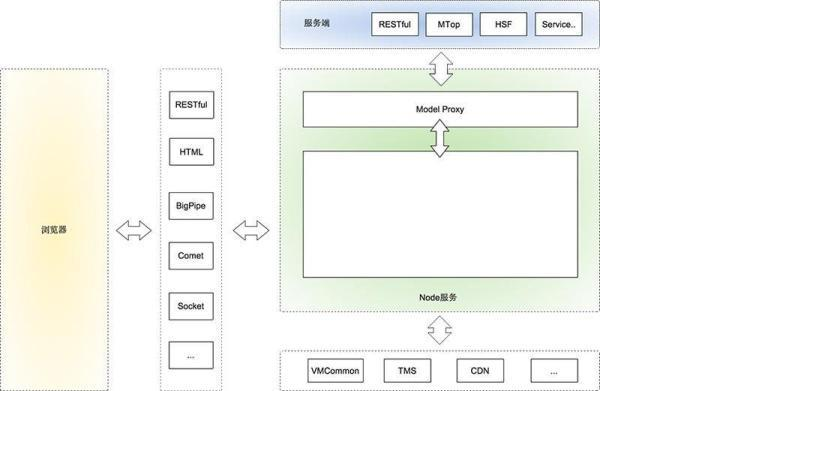
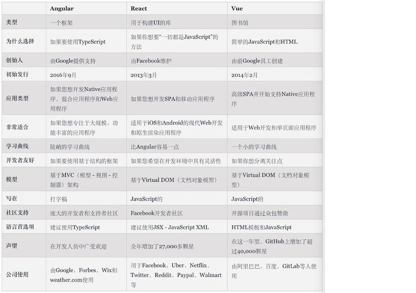
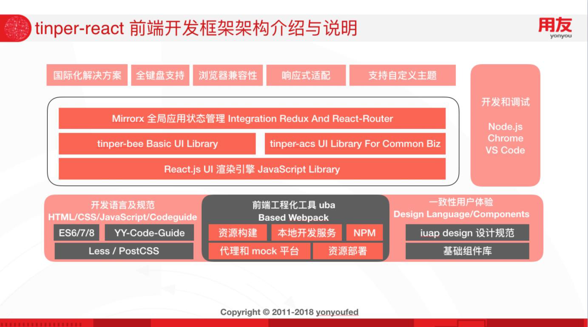

# iuap前端技术框架要点
## [1.前端技术发展史](https://baijiahao.baidu.com/s?id=1622870448182204203&wfr=spider&for=pc)
> **1.静态页面阶段**
>> &nbsp;&nbsp;互联网发展的早期，网站的前后端开发是一体的，即前端代码是后端代码的一部分。
>>> 1.后端收到浏览器的请求  
>>> 2.生成静态页面  
>>> 3.发送到浏览器  
>
>>&nbsp;&nbsp;那时的前端页面都是静态的，所有前端代码和前端数据都是后端生成的。前端只是纯粹的展示功能，脚本的作用只是增加一些特殊效果，比如那时很流行用脚本控制页面上飞来飞去的广告。  
>> 那时的网站开发，采用的是后端的MVC模式。
>>> Model(模型层):提供/保存数据
>>> Controller(控制层):数据处理，实现业务逻辑
>>> View(视图层):展示数据，提供用户界面

> **2.Ajax阶段**
>> &nbsp;&nbsp;2004年，AJAX 技术诞生，改变了前端开发。Gmail 和 Google 地图这样革命性的产品出现，使得开发者发现，前端的作用不仅仅是展示页面，还可以管理数据并与用户互动。AJAX 技术指的是脚本独立向服务器请求数据，拿到数据以后，进行处理并更新网页。整个过程中，后端只是负责提供数据，其他事情都由前端处理。前端不再是后端的模板，而是实现了从“获取数据 --》 处理数据 --》展示数据”的完整业务逻辑。就是从这个阶段开始，前端脚本开始变得复杂，不再仅仅是一些玩具性的功能。

> **3.前端MVC阶段**
>> &nbsp;&nbsp;前端代码有了读写数据、处理数据、生成视图等功能，因此迫切需要辅助工具，方便开发者组织代码。这导致了前端 MVC 框架的诞生。2010年，第一个前端 MVC 框架 Backbone.js 诞生。它基本上是把 MVC 模式搬到了前端，但是只有 M （读写数据）和 V（展示数据），没有 C（处理数据）。因为，Backbone 认为前端 Controller 与后端不同，不需要、也不应该处理业务逻辑，只需要处理 UI 逻辑，响应用户的一举一动。所以，数据处理都放在后端，前端只用事件响应处理 UI 逻辑（用户操作）。  
>> 后来，更多的前端 MVC 框架出现。另一些框架提出 MVVM 模式，用 View Model 代替 Controller。MVVM 模式也将前端应用分成三个部分。  
>>> Model:读写数据  
>>> View:展示数据  
>>> View-Model:数据处理  
>>  &nbsp;&nbsp;View Model 是简化的 Controller，所有的数据逻辑都放在这个部分。它的唯一作用就是为 View 提供处理好的数据，不含其他逻辑。也就是说，Model 拿到数据以后，View Model 将数据处理成视图层（View）需要的格式，在视图层展示出来.  
>> &nbsp;&nbsp;这个模型的特点是 View 绑定 View Model。如果 View Model 的数据变了，View（视图层）也跟着变了；反之亦然，如果用户在视图层修改了数据，也立刻反映在 View Model。整个过程完全不需要手工处理。 
>
> **3.SPA(single-page application)阶段**
>> &nbsp;&nbsp;前端可以做到读写数据、切换视图、用户交互，这意味着，网页其实是一个应用程序，而不是信息的纯展示。这种单张网页的应用程序称为 SPA（single-page application）。所谓 SPA，就是指在一张网页（single page）上，通过良好的体验，模拟出多页面应用程序（application）。用户的浏览器只需要将网页载入一次，然后所有操作都可以在这张页面上完成，带有迅速的响应和虚拟的页面切换。  
>> &nbsp;&nbsp;随着 SPA 的兴起，2010年后，前端工程师从开发页面（切模板），逐渐变成了开发“前端应用”（跑在浏览器里面的应用程序）。目前，最流行的前端框架 Vue、Angular、React 等等，都属于 SPA 开发框架。

> **[4.Node.js兴起的新web全栈时代](https://www.jianshu.com/p/0c7095791510)**
>>   
>> **什么是前后端分离？**  
>>> &nbsp;&nbsp;大家一致认同的前后端分离的例子就是SPA(Single-page application)，所有用到的展现数据都是后端通过异步接口(AJAX/JSONP)的方式提供的，前端只管展现。
从某种意义上来说，SPA确实做到了前后端分离，但这种方式存在两个问题：1.WEB服务中，SPA类占的比例很少。很多场景下还有同步/同步+异步混合的模式，SPA不能作为一种通用的解决方案。2.现阶段的SPA开发模式，接口通常是按照展现逻辑来提供的，有时候为了提高效率，后端会帮我们处理一些展现逻辑，这就意味着后端还是涉足了View层的工作，不是真正的前后端分离。  
>> &nbsp;&nbsp;SPA式的前后端分离，是从物理层做区分（认为只要是客户端的就是前端，服务器端的就是后端），这种分法已经无法满足我们前后端分离的需求，我们认为从职责上划分才能满足目前我们的使用场景：前端：负责View和Controller层。后端：只负责Model层，业务处理/数据等。

>> **SPA模式中，后端已供了所需的数据接口，view前端已经可以控制，为什么要多加NodeJS这一层？**  
>> &nbsp;&nbsp;现阶段我们主要以后端MVC的模式进行开发，这种模式严重阻碍了前端开发效率，也让后端不能专注于业务开发。
解决方案是让前端能控制Controller层，但是如果在现有技术体系下很难做到，因为不可能让所有前端都学java，安装后端的开发环境，写VM。
NodeJS就能很好的解决这个问题，我们无需学习一门新的语言，就能做到以前开发帮我们做的事情，一切都显得那么自然。  
>> **多加一层，性能怎么样？**  
>> &nbsp;&nbsp;分层就涉及每层之间的通讯，肯定会有一定的性能损耗。但是合理的分层能让职责清晰、也方便协作，会大大提高开发效率。分层带来的损失，一定能在其他方面的收益弥补回来。另外，一旦决定分层，我们可以通过优化通讯方式、通讯协议，尽可能把损耗降到最低。  
>> **前端的工作量是否增加了？**  
>> &nbsp;&nbsp;相对于只切页面/做demo，肯定是增加了一点，但是当前模式下有联调、沟通环节，这个过程非常花时间，也容易出bug，还很难维护。
所以，虽然工作量会增加一点，但是总体开发效率会提升很多。
另外，测试成本可以节省很多。以前开发的接口都是针对表现层的，很难写测试用例。如果做了前后端分离，甚至测试都可以分开，一拨人专门测试接口，一拨人专注测试UI（这部分工作甚至可以用工具代替）。  
>> **增加node层带来的风险怎么规避？**  
>> &nbsp;&nbsp;随着Node大规模使用，系统/运维/安全部门的同学也一定会加入到基础建设中，他们会帮助我们去完善各个环节可能出现的问题，保障系的稳定性。  
>> **node什么都能做为什么还要用java？**  
>> &nbsp;&nbsp;我们的初衷是做前后端分离，如果考虑这个问题就有点违背我们的初衷了。即使用Node替代Java，我们也没办法保证不出现今天遇到的种种问题，比如职责不清。我们的目的是分层开发，专业的人，专注做专业的事。基于JAVA的基础架构已经非常强大而且稳定，而且更适合做现在架构的事情。  
>> **淘宝基于node全栈的实例**  
>> 
>> 上图是我理解的淘宝基于Node的前后端分离分层，以及Node的职责范围。简单解释下：
>>>最上端是服务端，就是我们常说的后端。后端对于我们来说，就是一个接口的集合，服务端提供各种各样的接口供我们使用。因为有Node层，也不用局限是什么形式的服务。对于后端开发来说，他们只用关心业务代码的接口实现。  

>>>服务端下面是Node应用。  

>>>Node应用中有一层Model Proxy与服务端进行通讯。这一层主要目前是抹平我们对不同接口的调用方式，封装一些view层需要的Model。  

>>>Node层还能轻松实现原来vmcommon,tms（引用淘宝内容管理系统）等需求。  

>>>Node层要使用什么框架由开发者自己决定。不过推荐使用express+xTemplate的组合，xTemplate能做到前后端公用。  

>>>怎么用Node大家自己决定，但是令人兴奋的是，我们终于可以使用Node轻松实现我们想要的输出方式:JSON/JSONP/RESTful/HTML/BigPipe/Comet/Socket/同步、异步，想怎么整就怎么整，完全根据你的场景决定。   

>>>浏览器层在我们这个架构中没有变化，也不希望因为引入Node改变你以前在浏览器中开发的认知。   

>>>引入Node，只是把本该就前端控制的部分交由前端掌控。

> **5.以三大框架为主的新成熟阶段**  
>>   
>> 自 2016 年左右，纯 年左右，纯 web web前端技术的演进和发展 不再剧烈，经过无数开发人员的实践和沉不再剧烈，经过无数开发人员的实践和沉 淀，ReactReactReactReactReact、VueVue 、Angular AngularAngularAngular 三大框架成为了熟阶段的 三大框架成为了熟阶段的 UI LibararyUI LibararyUI LibararyUI LibararyUI Libarary UI LibararyUI LibararyUI LibararyUI LibararyUI Libarary和 FrameworkFramework Framework Framework Framework。其中， 。其中， React React React React React React 在全球使用者中占比最高； Vue Vue Vue 也以其文档和上手快的特点速升； Angular Angular 也快速的发布 也快速的发布 了 7.X 版本。
Tinper inper 前端技术平台选择基于 前端技术平台选择基于 React.js React.js React.js React.js React.js React.js 作为 Basic UI LibraryBasic UI LibraryBasic UI Library Basic UI LibraryBasic UI LibraryBasic UI LibraryBasic UI LibraryBasic UI Library Basic UI LibraryBasic UI Library，其 WebWebWeb组件化能力、基于 FiberFiber 算法的渲染引擎、 算法的渲染引擎、 Vitual DOM Vitual DOM Vitual DOM Vitual DOM 机制、组件生命周期管理等特性，能够让我们专注于应用 机制、组件生命周期管理等特性，能够让我们专注于应用 机制、组件生命周期管理等特性，能够让我们专注于应用 层的开发。并且，基于 ReacReacReacReact 的社区生态，能够拥抱更多技术红利。

# 2.tinper-react前端技术框架
## 2.1 整体架构介绍
> 
>> 如上图所示， tinper tinper tinper-react react react react 是一个基于 ReactReactReactReactReact的现代化前端框架，包含工程、开发语 的现代化前端框架，包含工程、开发语 的现代化前端框架，包含工程、开发语 言及规范、一致性用户体验前端组件库等能力，集成了全局应状态管理方案和路由并提供了国际化、全键盘支持响应式适 配等能力，具备完整的前端架构所需各项并提供了国际化、全键盘支持响应式适 配等能力，具备完整的前端架构所需各项并提供了国际化、全键盘支持响应式适 配等能力，具备完整的前端架构所需各项并提供了国际化、全键盘支持响应式适 配等能力，具备完整的前端架构所需各项并提供了国际化、全键盘支持响应式适 配等能力，具备完整的前端架构所需各项用.  
>>掌握 React.js React.js React.js React.js React.js React.js 基础，熟悉组件定义、生命周期事等能力并且从以操作 基础，熟悉组件定义、生命周期事等能力并且从以操作 基础，熟悉组件定义、生命周期事等能力并且从以操作 基础，熟悉组件定义、生命周期事等能力并且从以操作 基础，熟悉组件定义、生命周期事等能力并且从以操作 基础，熟悉组件定义、生命周期事等能力并且从以操作 DOM 为核心 的思维中（以 JqueryJquery JqueryJquery使用者为代表）向组件化思维转变。 使

