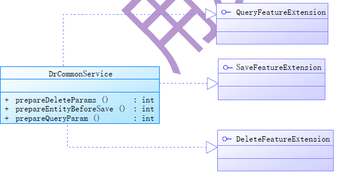
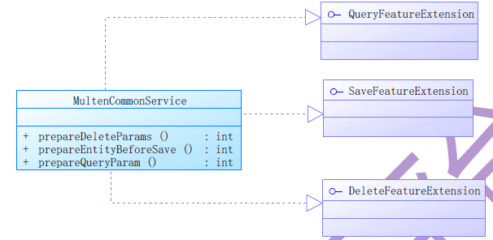
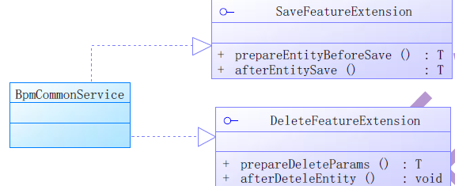

# iuap后端中级
## 组件集成模块intg
> 组件集成模块里分别实现组件特性,最终通过intg 集成模块实现可插拔式的组合。  
实现方式为：业务单据服务层继承
com.yonyou.iuap.baseservice.intg.service.GenericIntegrateService，复写getFeats()，
定义功能特性；
特征定义：com.yonyou.iuap.baseservice.intg.support.ServiceFeature
	
	//特征实现全局预定义，运行时可以根据需求动态加载
 	ATTACHMENT("com.yonyou.iuap.baseservice.attachment.service.AtCommonService"), //附件特性
    MULTI_TENANT("com.yonyou.iuap.baseservice.multitenant.service.MultenCommonService"),  //多租户隔离特性
    LOGICAL_DEL("com.yonyou.iuap.baseservice.intg.service.DrCommonService"), //逻辑删除特性
    REFERENCE("com.yonyou.iuap.baseservice.ref.service.RefCommonService"),  //本地参照特性
    BPM("com.yonyou.iuap.baseservice.bpm.service.BpmCommonService"),  //流程特性
    DATA_PERMISSION("com.yonyou.iuap.baseservice.datapermission.service.DpCommonService"),  //数据权限特性
    I18N("com.yonyou.iuap.baseservice.intg.service.I18nCommonService"),  //国际化特性
    OTHER("java.lang.Class");  //其他特性
### 特征拓展接口
**com.yonyou.iuap.baseservice.persistence.support.QueryFeatureExtension<T>**特征查询接口

	public interface QueryFeatureExtension<T extends Model> {
    SearchParams prepareQueryParam(SearchParams var1, Class var2); //查询前处理查询条件

    List<T> afterListQuery(List<T> var1);
	}  //查询后处理结果数据

**com.yonyou.iuap.baseservice.persistence.support.SaveFeatureExtension<T>**特征保存接口

	public interface SaveFeatureExtension<T extends Model> {
    T prepareEntityBeforeSave(T var1); //保存前处理待保存数据

    T afterEntitySave(T var1);  //保存后处理结果数据
	}

**com.yonyou.iuap.baseservice.persistence.support.DeleteFeatureExtension<T>**特征删除接口

	public interface DeleteFeatureExtension<T extends Model> {
    T prepareDeleteParams(T var1, Map var2); //删除前处理

    void afterDeteleEntity(T var1);  //删除后处理数据
	}
## 框架实现特征
> 特征框架组件实现了上面提到的特征接口，但由于业务要求，实现的方法都各有不同。
### LOGICAL_DEL（逻辑删除）
字段名称 | 编码 | 类型 | 长度 | 备注
--------| ----|  ---| --- | ----
删除标志位 |DR | Decimal | 11 | 逻辑删除标识 0 否 / 1 是
> 逻辑删除的字段为dr，当dr为0时代表否，1代表是  
> 逻辑删除的包为com.yonyou.iuap.baseservice.intg.service.DrCommonService，代码实现了特征拓展接口。示意图如下：

	@Service
	public class DrCommonService<T extends Model & LogicDel> implements QueryFeatureExtension<T>, SaveFeatureExtension<T>, DeleteFeatureExtension<T> {
    public DrCommonService() {
    }

    public SearchParams prepareQueryParam(SearchParams searchParams, Class modelClass) {
        searchParams.addCondition("dr", LogicDel.NORMAL);
        return searchParams;
    }

    public List<T> afterListQuery(List<T> list) {
        return list;
    }

    public T prepareEntityBeforeSave(T entity) {
        if (entity.getId() == null || ((LogicDel)entity).getDr() == null) {
            ((LogicDel)entity).setDr(LogicDel.NORMAL);
        }

        return entity;
    }

    public T afterEntitySave(T entity) {
        return entity;
    }

    public T prepareDeleteParams(T entity, Map params) {
        if (entity.getId() != null) {
            ((LogicDel)entity).setDr(LogicDel.DELETED);
        }

        return entity;
    }

    public void afterDeteleEntity(T entity) {
    }
	}
> **如何引用?**  
> 1. entity继承AbsDrModel  
> 2. Service继承GenericIntegrateService<T>并添加注入特性service 的方法  

	@Override
	protected ServiceFeature[] getFeats() {
	return new ServiceFeature[] {LOGICAL_DEL};
	}
### MULTI_TENANT（多租户隔离特性）
字段名称 | 编码 | 类型 | 长度 | 备注
--------| ----|  ---| --- | ----
多租户标识 |TENANT_ID | Varchar | 64 | 租户
> 租户隔离的包为com.yonyou.iuap.baseservice.multitenant.service.MultenCommonService。示意关系图如下：

	@Service
	public class MultenCommonService<T extends MultiTenant> implements QueryFeatureExtension<T>, SaveFeatureExtension<T>, DeleteFeatureExtension<T> {
    public MultenCommonService() {
    }

    public SearchParams prepareQueryParam(SearchParams searchParams, Class modelClass) {
        Map<String, Object> searchMap = searchParams.getSearchMap();
        String tenantidInMap = String.valueOf(searchMap.get("tenantid"));
        if (StringUtils.isEmpty(tenantidInMap) || "null".equals(tenantidInMap)) {
            searchMap.put("tenantid", InvocationInfoProxy.getTenantid());
        }

        return searchParams;
    }

    public List<T> afterListQuery(List<T> list) {
        return list;
    }

    public T prepareEntityBeforeSave(T entity) {
        entity.setTenantid(InvocationInfoProxy.getTenantid());
        return entity;
    }

    public T afterEntitySave(T entity) {
        return entity;
    }

    public T prepareDeleteParams(T entity, Map params) {
        entity.setTenantid(InvocationInfoProxy.getTenantid());
        params.put("tenantid", InvocationInfoProxy.getTenantid());
        return entity;
    }

    public void afterDeteleEntity(T entity) {
    }
	}
> **如何引用?**  
> 1. entity继承MultiTenant   
> 2. Service继承GenericIntegrateService<T>并添加注入特性service 的方法 

	@Override
	protected ServiceFeature[] getFeats() {
	return new ServiceFeature[] {MULTI_TENANT };
	}
### REFERENCE(本地参照)？

### BPM(流程特性)
字段名称 | 编码 | 类型 | 长度 | 备注
--------| ----|  ---| --- | ----
流程状态 |BPM_STATE | Decimal | 11 | 流程状态枚举值  0待确认 / 1执行中 / 2已办理
> 流程特性的包为com.yonyou.iuap.baseservice.bpm.service.BpmCommonService<T>，示意关系图如下：

	@Service
	public class BpmCommonService<T extends BpmSimpleModel> implements SaveFeatureExtension<T>, DeleteFeatureExtension<T> {
    public BpmCommonService() {
    }

    public T prepareEntityBeforeSave(T entity) {
        if (entity.getId() == null || entity.getBpmState() == null) {
            entity.setBpmState(0);
        }

        return entity;
    }

    public T afterEntitySave(T entity) {
        return entity;
    }

    public T prepareDeleteParams(T entity, Map params) {
        if (entity.getBpmState() != null) {
            int bpmstate = entity.getBpmState();
            if (bpmstate != 1 && bpmstate != 1) {
                return entity;
            } else {
                throw new BusinessException("流程正在运行，无法删除");
            }
        } else {
            return entity;
        }
    }

    public void afterDeteleEntity(T entity) {
    }
	}
> **如何引用?**  
> 1. entity继承AbsBpmModel，实现getBpmBillCode 方法   
> 2. Service继承GenericIntegrateService<T>并添加注入特性service 的方法 

	@Override
	protected ServiceFeature[] getFeats() {
	return new ServiceFeature[] {BPM };
	}
>3.Controller  
业务单据需要新增bpmController 类，继承GenericBpmController，所有调用
的接口都在父类实现， 同时需要注入步骤2 中的service 。示例如
com.yonyou.iuap.purchaseorder.controller.PurchaseOrderBpmController。

