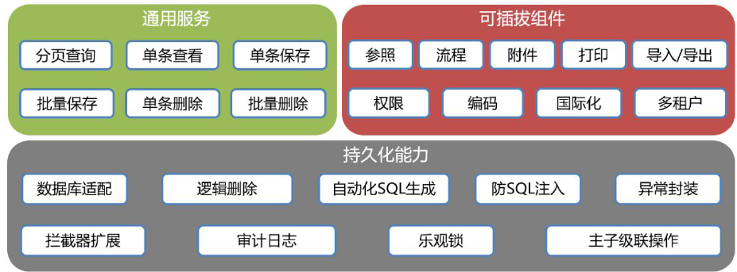
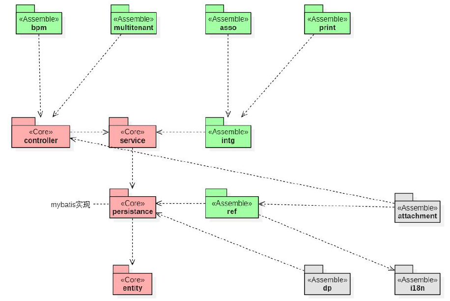
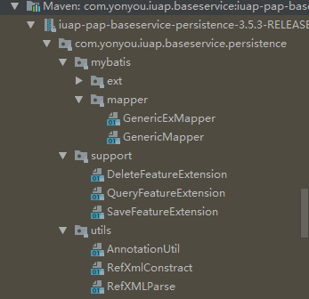

# iuap后端知识
>iuap-pap-baseservice 框架属于iuap 快速开发体系中的后台支持部分，通过与iuap 前端开发框架结合,可快速的实现一套业务表单系统开发。    
## 框架特性：  
>简化单表/主子表CRUD 服务开发及通用性的持久化能力  
 简化iuap 参照组件集成  
 提供iuap 应用平台组件(流程、多租户、编码规则、打印、导入导出、附件、数据权限)可插拔式集成  
 简化tinper 前端组件集成
## 功能架构：

## 模块详解
**后端框架关系图**

### 实体类(Entity)
> iuap-pap-baseservice-entity  
> &nbsp;&nbsp;实体层能力强化框架，提供业务模型基本能力（乐观锁，审计日志，逻辑删除等）规范，以及构建数据库查询能力的数据模型映射注解。通过注解和接口来强化、扩展业务模型的能力范围。模型注解沿用了部分JSR338 的标准，如@Table``@Column 等来实现业务模型与数据模型的映射关系声明。为了保证查询范围的安全性和可控性，CRUD 核心模块采用@Condition注解构建查询模型，用SearchParams 规范查询条件参数。如果查询条件超过了规范的范畴，只能通过自定义mybatis节点的方式扩展实现.  
#### 模型标准Model 接口 
>> 此接口为BaseService 及泛型控制基础，几乎所有泛型声明都是以此接口为基类，例如VerLock 接口AbsModel 基类.  
  
	package com.yonyou.iuap.baseservice.entity;
	
	import java.io.Serializable;

	public interface Model {
	    Serializable getId();  
	
	    void setId(Serializable var1);
	
	    String getCreateTime();
	
	    void setCreateTime(String var1);
	
	    String getCreateUser();
	
	    void setCreateUser(String var1);
	
	    String getLastModified();
	
	    void setLastModified(String var1);
	
	    String getLastModifyUser();
	
	    void setLastModifyUser(String var1);
	
	    String getTs();
	
	    void setTs(String var1);
	}
#### 查询模型
>> @Table注解为数据库表的名字  
>> @Column注解为实体所对应的的数据库列字段的名字  
>> @Condition注解为连接的查询条件（不太懂）

	@Target({ElementType.FIELD})
	@Retention(RetentionPolicy.RUNTIME)
	public @interface Condition {
	Match match() default Match.EQ; //condition有一个match方法，若满足匹配则注入bean，不满足则忽略
	
	String param1() default "";
	
	String param2() default "";
	
	String format() default "";
	}

#### 逻辑删除
##### LogicDel接口
	public interface LogicDel {
	    Integer DELETED = 1;
	    Integer NORMAL = 0;
	
	    Integer getDr();
	
	    void setDr(Integer var1);
	}
##### AbsDrModel 基类
>> public abstract class AbsDrModel extends AbsModel implements Model, LogicDel，由此看来AbsDrModel继承了AbsModel实现了Model和LogicDel.  
>> **AbsModel代码：**  

	public abstract class AbsModel implements Model, VerLock {
	    @Id
	    @GeneratedValue
	    @Column(
	        name = "id"
	    )
	    @Condition
	    protected Serializable id;
	    @Column(
	        name = "create_time"  //创建时间
	    )
	    protected String createTime;
	    @Column(
	        name = "create_user"  //创建用户
	    )
	    @Condition
	    protected String createUser;
	    @Column(
	        name = "last_modified" //文件最后一次修改日期
	    )
	    protected String lastModified;
	    @Column(
	        name = "last_modify_user"
	    )
	    @Condition
	    protected String lastModifyUser;  //文件最后一次修改者
	    @Version
	    @ReferValue("newTs")
	    @Column(
	        name = "ts"
	    )
	    @Condition
	    protected String ts;
	    @Transient
	    protected String newTs;
	
	    public AbsModel() {
	    }
	}
>> 在AbsModel中实现了Model，VerLock的方法  
>> **VerLock代码如下（不太懂）：**

	public interface VerLock {
	    String getTs();
	
	    void setTs(String var1);
	
	    String getNewTs();
	
	    void setNewTs(String var1);
	}
>> **AbsDrModel代码如下（一般自己建的实体类都继承这个）：**

	public abstract class AbsDrModel extends AbsModel implements Model, LogicDel {
	    @Column(
	        name = "dr"
	    )
	    @Condition
	    protected Integer dr = 0; //判断dr的值，如果是0则代表normal状态将其注入到bean中。如果为1代表deleted状态，不将其注入。（LogicDel中体现）
	
	    public AbsDrModel() {
	    }
	
	    public Integer getDr() {
	        return this.dr;
	    }
	
	    public void setDr(Integer dr) {  //实现LogicDel的setDr方法
	        this.dr = dr;
	    }
	}
#### 主子表注解（Associative 注解）
	@Target({ElementType.TYPE})
	@Retention(RetentionPolicy.RUNTIME)
	public @interface Associative {
	    String fkName() default "";
	
	    boolean deleteCascade() default true;
	}

#### ID生成@GeneratedValue【默认UUID】
#### 参照反写Reference 注解
#### 编码生成CodingEntity
#### 租户隔离MultiTenant 接口

### 数据持久层（persistence）
> 适配的数据库为：mysql,oracle,sql server

**com.yonyou.iuap.baseservice.persistence.mybatis.mapper.GenericMapper<T>**包含了封装的各种对数据库的操作方法。
>>查询方法：

 	@MethodMapper(
        type = SqlCommandType.SELECT
    )
	PageResult<T> selectAllByPage(@Param("page") PageRequest var1, @Param("condition") SearchParams var2);   selectAllByPage方法（page传递页码参数，condition传递关键字）

 	@MethodMapper(
        type = SqlCommandType.SELECT
    )
    List<T> queryList(@Param("condition") Map<String, Object> var1);   //queryList列表查询

 	@MethodMapper(
        type = SqlCommandType.SELECT
    )
    List<Map<String, Object>> queryListByMap(@Param("condition") Map<String, Object> var1);  //queryListByMap列表多条件查询
>> 添加方法：

 	@MethodMapper(
        type = SqlCommandType.INSERT
    )
    int insert(T var1);  //insert全部插入

    @MethodMapper(
        type = SqlCommandType.INSERT,
        isSelective = true
    )
    int insertSelective(T var1);  //insertSelective局部插入
>>更新方法：

    @MethodMapper(
        type = SqlCommandType.UPDATE
    )
    int update(T var1);  //update全部更新

    @MethodMapper(
        type = SqlCommandType.UPDATE,
        isSelective = true
    )
    int updateSelective(T var1);  //updateSelective局部更新

>> 删除方法：

	@MethodMapper(
        type = SqlCommandType.DELETE
    )
    int delete(@Param("condition") Map<String, Object> var1); //delete条件删除数据
### 服务层（Service）
> 查询服务：

 	public Page<T> selectAllByPage(PageRequest pageRequest, SearchParams searchParams) {
        return this.genericMapper.selectAllByPage(pageRequest, searchParams).getPage();
    }  //按照条件分页查询返回数据

    public List<T> findAll() {
        Map<String, Object> queryParams = new HashMap();
        return this.queryList(queryParams);
    }  //查询返回所有符合条件的数据

    public List<T> queryList(Map<String, Object> queryParams) {
        return this.genericMapper.queryList(queryParams);
    }  //多条件列表查询，查询时会根据Entity 中的@Condition 注解拼接查询函数，返回的一般为实体类

    public List<T> queryList(String name, Object value) {
        Map<String, Object> queryParams = new HashMap();
        queryParams.put(name, value);
        return this.queryList(queryParams);
    }  //但条件列表查询，只有一个条件，返回实体类

    public List<Map<String, Object>> queryListByMap(Map<String, Object> params) {
        return this.genericMapper.queryListByMap(params);
    }  //多条件查询，返回一个map的列表，而非一个实体类

    public T findById(Serializable id) {
        return this.findUnique("id", id);
    }  //通过序列化编号查找实体类数据

    public T findUnique(String name, Object value) {
        List<T> listData = this.queryList(name, value);
        if (listData != null && listData.size() == 1) {
            return (Model)listData.get(0);
        } else {
            throw new RuntimeException("检索数据不唯一, " + name + ":" + value);
        }
    }  //唯一性查询，查出的结果必须只有一个，否则有异常

> 保存数据：

 	public T save(T entity) {
        boolean isNew = false;
        if (entity instanceof Model) {
            if (entity.getId() == null) {
                isNew = true;
            } else {
                isNew = StrUtil.isEmptyIfStr(entity.getId());
            }
        }

        return isNew ? this.insert(entity) : this.update(entity);
    }  //全量保存，save(T entity)处理了新增保存和修改保存

    public void saveBatch(List<T> listEntity) {
        for(int i = 0; i < listEntity.size(); ++i) {
            this.save((Model)listEntity.get(i));
        }

    }  //批量保存

> 插入操作：

 	public T insert(T entity) {
        return this.executeInsert(entity, false);
    }  //插入实体entity

    public T insertSelective(T entity) {
        return this.executeInsert(entity, true);
    }  //局部插入，新增保存数据,跳过空值字段

    protected T executeInsert(T entity, boolean isSelective) {
        if (entity == null) {
            throw new RuntimeException("新增保存数据出错，对象为空!");
        } else {
            if (entity.getId() == null || StrUtil.isBlankIfStr(entity.getId())) {
                this.genAndSetEntityId(entity);
            }

            String now = DateUtil.format(new Date(), "yyyy-MM-dd HH:mm:ss SSS");
            entity.setCreateTime(now);
            entity.setCreateUser(InvocationInfoProxy.getUserid());
            entity.setLastModified(now);
            entity.setLastModifyUser(InvocationInfoProxy.getUserid());
            entity.setTs(now);
            if (entity.getClass().getAnnotation(CodingEntity.class) != null) {
                CodingUtil.inst().buildCoding(entity);
            }

            if (isSelective) {
                this.genericMapper.insertSelective(entity);
                BeanUtils.copyProperties(this.findById(entity.getId()), entity);
            } else {
                this.genericMapper.insert(entity);
            }

            this.log.info("新增保存数据：\r\n" + JSON.toJSONString(entity));
            return entity;
        }
    }
> 更新操作：

  	public T update(T entity) {
        return this.executeUpdate(entity, false);
    }  //isSelective参数为false，单个实体全部更新

    public T updateSelective(T entity) {
        return this.executeUpdate(entity, true);
    }  //isSelective参数为true，代表只需要对这个实体进行局部更新即可，修改保存数据,跳过空值字段

    protected T executeUpdate(T entity, boolean isSelective) {
        if (entity != null) {
            String now = DateUtils.formatDate(new Date(), "yyyy-MM-dd HH:mm:ss SSS");
            entity.setLastModified(now);
            entity.setLastModifyUser(InvocationInfoProxy.getUserid());
            int count;
            if (isSelective) {
                count = this.genericMapper.updateSelective(entity);
            } else {
                count = this.genericMapper.update(entity);
            }

            if (count != 1) {
                this.log.error("更新保存数据出错，更新记录数=" + count + "\r\n" + JSON.toJSONString(entity));
                throw new RuntimeException("更新保存数据出错，更新记录数=" + count);
            } else {
                if (isSelective) {
                    BeanUtils.copyProperties(this.findById(entity.getId()), entity);
                }

                return entity;
            }
        } else {
            this.log.error("更新保存数据出错，输入参数对象为空!");
            throw new RuntimeException("更新保存数据出错，输入参数对象为空!");
        }
    }
> 删除操作：

  	public int deleteBatch(List<T> list) {
        int count = 0;

        Model entity;
        for(Iterator var3 = list.iterator(); var3.hasNext(); count += this.delete(entity)) {
            entity = (Model)var3.next();
        }

        return count;
    }  //由于参数是一个List,批量删除操作，最终返回删除的条数

    public int delete(T entity) {
        return this.delete(entity.getId());
    }  //删除单个实体

    public int delete(Serializable id) {
        Map<String, Object> data = new HashMap();
        data.put("id", id);
        int count = this.genericMapper.delete(data);
        if (count == 1) {
            return count;
        } else {
            this.log.error("删除数据出错,记录数=" + count + "\r\n" + JSON.toJSONString(id));
            throw new RuntimeException("删除数据出错,记录数=" + count + "\r\n" + JSON.toJSONString(id));
        }
    }  //根据ID进行删除

    private void genAndSetEntityId(T entity) {
        if (entity.getId() == null || StrUtil.isBlankIfStr(entity.getId())) {
            Serializable id = GeneratorManager.generateID(entity);
            entity.setId(id);
        }

    }  //如果这个实体没有ID则生成自增长的ID，否则public int delete(Serializable id)方法不能使用。
### 控制器层（Controller）
> 分页查询list

  	@RequestMapping({"/list"})
    @ResponseBody
    public Object list(PageRequest pageRequest, SearchParams searchParams) {
        Page<T> page = this.service.selectAllByPage(pageRequest, searchParams);
        Map<String, Object> map = new HashMap();
        map.put("data", page);
        return this.buildMapSuccess(map);
    }  //pageRequest为分页请求，searchParams为查询参数，返回封装好的数据
> 单条查询get

	@RequestMapping({"/get"})
    @ResponseBody
    public Object get(PageRequest pageRequest, SearchParams searchParams) {
        String id = MapUtils.getString(searchParams.getSearchMap(), "id");
        if (id == null) {
            return this.buildSuccess();
        } else if (StrUtil.isBlank(id)) {
            return this.buildError("msg", "主键id参数为空!", RequestStatusEnum.FAIL_FIELD);
        } else {
            T entity = this.service.findById(id);
            return this.buildSuccess(entity);
        }
    }  //通过主键ID进行单个查找实体类

> 单个保存

  	@RequestMapping({"/save"})
    @ResponseBody
    public Object save(@RequestBody T entity) {
        JsonResponse jsonResp;
        try {
            this.service.save(entity);
            jsonResp = this.buildSuccess(entity);
        } catch (Exception var4) {
            jsonResp = this.buildError("msg", var4.getMessage(), RequestStatusEnum.FAIL_FIELD);
        }

        return jsonResp;
    }  //参数为一个实体，功能为对这个实体进行保存

> 批量保存

  	@RequestMapping({"/saveBatch"})
    @ResponseBody
    public Object saveBatch(@RequestBody List<T> listData) {
        this.service.saveBatch(listData);
        return this.buildSuccess();
    }  //list实体类的批量保存操作

> 单个删除操作

    @RequestMapping({"/delete"})
    @ResponseBody
    public Object delete(@RequestBody T entity, HttpServletRequest request, HttpServletResponse response) throws Exception {
        this.service.delete(entity);
        return super.buildSuccess();
    }  //参数为一个实体并对其进行删除操作

> 批量删除

    @RequestMapping({"/deleteBatch"})
    @ResponseBody
    public Object deleteBatch(@RequestBody List<T> listData, HttpServletRequest request, HttpServletResponse response) throws Exception {
        this.service.deleteBatch(listData);
        return super.buildSuccess();
    }  //参数为list实体集并对他们进行删除
