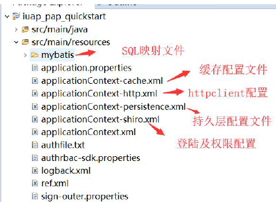

# 项目xml配置

## [web.xml文件中的各个属性值](https://blog.csdn.net/ckc_666/article/details/82964812)
### <display-name>
> web应用名称，提供GUI工具可能会用来标记这个特定的Web应用的一个名称

	<display-name>iuap_pap_quickstart</display-name>//此应用的名字为iuap_pap_quickstart
### <disciption>
> web应用描述，给出与此相关的说明性文本

	<disciption>iuap_pap_quickstart servlets and JSP pages.</disciption>
### <context-param>
> 上下文参数，声明应用范围内的初始化参数。它用于向 ServletContext提供键值对，即应用程序上下文信息。我们的listener, filter等在初始化时会用到这些上下文中的信息。在servlet里面可以通过getServletContext().getInitParameter("context/param")得到。

	  <context-param>
	    <param-name>contextConfigLocation</param-name>
	    <param-value>
				classpath*:/applicationContext.xml,
				classpath*:/applicationContext-cache.xml,
				classpath*:/applicationContext-persistence.xml,
				classpath*:/applicationContext-shiro.xml,
				classpath*:/applicationContext-http.xml
			</param-value>
	  </context-param>
	 <context-param>
	    <param-name>spring-mvc-servlet-name</param-name>
	    <param-value>springServlet</param-value>
	  </context-param>
### <filter>
> 将一个名字与一个实现javaxs.servlet.Filter接口的类相关联。

	 <filter>
	    <filter-name>encodingFilter</filter-name>
	    <filter-class>org.springframework.web.filter.CharacterEncodingFilter</filter-class>
	    <init-param>
	      <param-name>encoding</param-name>
	      <param-value>UTF-8</param-value>
	    </init-param>
	    <init-param>
	      <param-name>forceEncoding</param-name>
	      <param-value>true</param-value>
	    </init-param>
	  </filter>
	 <filter-mapping>
	    <filter-name>encodingFilter</filter-name>
	    <url-pattern>/*</url-pattern>
	  </filter-mapping>
### <listener>
> 监听器

	 <listener>
	    <listener-class>org.springframework.web.context.ContextLoaderListener</listener-class>
	  </listener>
### <servlet>
> <servlet></servlet> 用来声明一个servlet的数据，主要有以下子元素：

1. <servlet-name></servlet-name> 指定servlet的名称
2. <servlet-class></servlet-class> 指定servlet的类名称
3. <jsp-file></jsp-file> 指定web站台中的某个JSP网页的完整路径
4. <init-param></init-param> 用来定义参数，可有多个init-param。在servlet类中通过getInitParamenter(String name)方法访问初始化参数
5. <load-on-startup></load-on-startup>指定当Web应用启动时，装载Servlet的次序。当值为正数或零时：Servlet容器先加载数值小的servlet，再依次加载其他数值大的servlet。当值为负或未定义：Servlet容器将在Web客户首次访问这个servlet时加载它。
6. <servlet-mapping></servlet-mapping> 用来定义servlet所对应的URL，包含两个子元素
7. <servlet-name></servlet-name> 指定servlet的名称
8. <url-pattern></url-pattern> 指定servlet所对应的URL

		<servlet>
		<servlet-name>springServlet</servlet-name>
		<servlet-class>org.springframework.web.servlet.DispatcherServlet</servlet-class>
		<init-param>
		  <param-name>contextConfigLocation</param-name>
		  <param-value>/WEB-INF/spring-mvc.xml</param-value>
		</init-param>
		<load-on-startup>1</load-on-startup>
		<async-supported>true</async-supported>
		</servlet>
		<servlet-mapping>
		<servlet-name>springServlet</servlet-name>
		<url-pattern>/</url-pattern>
		</servlet-mapping>
### <session-config>
> 会话超时配置，单位为分钟

		<session-config>
		    <session-timeout>120</session-timeout>
		</session-config>
### <error-page>
> 配置错误页面

		 <error-page>
		    <exception-type>java.lang.Throwable</exception-type>
		    <location>/WEB-INF/views/error/500.jsp</location>
		  </error-page>
		  <error-page>
		    <error-code>500</error-code>
		    <location>/WEB-INF/views/error/500.jsp</location>
		  </error-page>
		  <error-page>
		    <error-code>404</error-code>
		    <location>/WEB-INF/views/error/404.jsp</location>
		  </error-page>
### Mapping匹配规则
> 当一个请求发送到servlet容器的时候，容器先会将请求的url减去当前应用上下文的路径作为servlet的映射url，比如我访问的是http://localhost/test/aaa.html，我的应用上下文是test，容器会将http://localhost/test去掉，剩下的/aaa.html部分拿来做servlet的映射匹配。这个映射匹配过程是有顺序的，而且当有一个servlet匹配成功以后，就不会去理会剩下的servlet了。  
> **匹配规则如下：**
> 
1. 精确路径匹配。例子：比如servletA 的url-pattern为 /test，servletB的url-pattern为 /* ，这个时候，如果我访问的url为http://localhost/test ，这个时候容器就会先 进行精确路径匹配，发现/test正好被servletA精确匹配，那么就去调用servletA，也不会去理会其他的servlet了。
2. 最长路径匹配。例子：servletA的url-pattern为/test/*，而servletB的url-pattern为/test/a/*，此时访问http://localhost/test/a时，容器会选择路径最长的servlet来匹配，也就是这里的servletB。
3. 扩展匹配，如果url最后一段包含扩展，容器将会根据扩展选择合适的servlet。例子：servletA的url-pattern：*.action

以”/’开头和以”/\*”结尾的是用来做路径映射的。以前缀”\*.”开头的是用来做扩展映射的。所以，为什么定义”/*.action”这样一个看起来很正常的匹配会错？因为这个匹配即属于路径映射，也属于扩展映射，导致容器无法判断。

## Mapper的实体类xml配置

